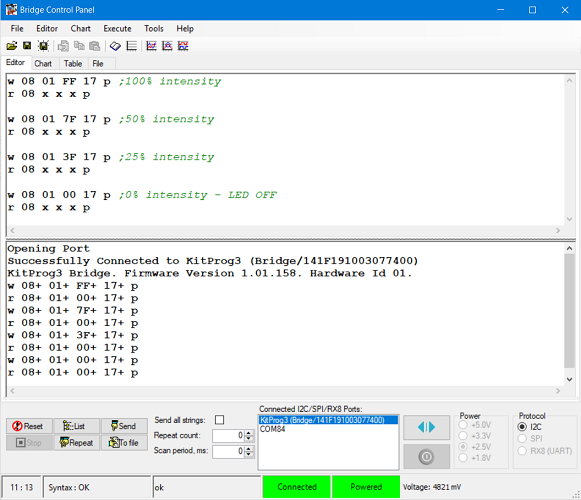
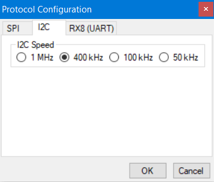

# PSoC&trade; 4: I2C slave using callbacks

[View this README on GitHub.](https://github.com/Infineon/mtb-example-psoc4-i2c-slave-callback)

[Provide feedback on this code example.](https://cypress.co1.qualtrics.com/jfe/form/SV_1NTns53sK2yiljn?Q_EED=eyJVbmlxdWUgRG9jIElkIjoiQ0UyMzA2MDMiLCJTcGVjIE51bWJlciI6IjAwMi0zMDYwMyIsIkRvYyBUaXRsZSI6IlBTb0MmdHJhZGU7IDQ6IEkyQyBzbGF2ZSB1c2luZyBjYWxsYmFja3MiLCJyaWQiOiJhaGFyIiwiRG9jIHZlcnNpb24iOiIyLjEuMCIsIkRvYyBMYW5ndWFnZSI6IkVuZ2xpc2giLCJEb2MgRGl2aXNpb24iOiJNQ0QiLCJEb2MgQlUiOiJJQ1ciLCJEb2MgRmFtaWx5IjoiUFNPQyJ9)

## Requirements

- [ModusToolbox&trade; software](https://www.cypress.com/products/modustoolbox-software-environment) v2.4 or later

  **Note:** This code example version requires ModusToolbox&trade; software version 2.4 or later and is not backward compatible with v2.3 or older versions.

- Board support package (BSP) minimum required version: 2.0.0
- Programming language: C
- Associated parts: [PSoC&trade; 4000S](https://www.cypress.com/documentation/datasheets/psoc-4-psoc-4000s-family-datasheet-programmable-system-chip-psoc), [PSoC&trade; 4100S](https://www.cypress.com/documentation/datasheets/psoc-4-psoc-4100s-family-datasheet-programmable-system-chip-psoc), [PSoC&trade; 4100S Plus](https://www.cypress.com/documentation/datasheets/psoc-4-psoc-4100s-plus-datasheet-programmable-system-chip-psoc), [PSoC&trade; 4500S](https://www.cypress.com/documentation/datasheets/psoc-4-psoc-4500s-datasheet-programmable-system-chip-psoc), and [PSoC&trade; 4100S Max](https://www.cypress.com/documentation/datasheets/psoc-4-psoc-4100s-max-datasheet-programmable-system-chip-psoc)

## Supported toolchains (make variable 'TOOLCHAIN')

- GNU Arm® embedded compiler v10.3.1 (GCC_ARM) - Default value of `TOOLCHAIN`
- Arm&reg; compiler v6.13 (ARM)
- IAR C/C++ compiler v8.42.2 (IAR)

## Supported kits (make variable 'TARGET')

- [PSoC&trade; 4100S Max pioneer kit](https://www.cypress.com/CY8CKIT-041s-max) (CY8CKIT-041S-MAX) - Default value of `TARGET`
- [PSoC&trade; 4100S Plus prototyping kit](https://www.cypress.com/CY8CKIT-149) (CY8CKIT-149)
- [PSoC&trade; 4100S CAPSENSE&trade; pioneer kit](https://www.cypress.com/CY8CKIT-041-41xx) (CY8CKIT-041-41XX)
- [PSoC&trade; 4000S CAPSENSE&trade; prototyping kit](https://www.cypress.com/CY8CKIT-145-40xx) (CY8CKIT-145-40XX)
- [PSoC&trade; 4500S pioneer kit](https://www.cypress.com/CY8CKIT-045S) (CY8CKIT-045S)

## Hardware setup

This example uses the board's default configuration. See the kit user guide to ensure that the board is configured correctly.

**Note:** PSoC&trade; 4 kits ship with KitProg2 installed. ModusToolbox&trade; software requires KitProg3. Before using this code example, make sure that the board is upgraded to KitProg3. The tool and instructions are available in the [Firmware Loader](https://github.com/Infineon/Firmware-loader) GitHub repository. If you do not upgrade, you will see an error like "unable to find CMSIS-DAP device" or "KitProg firmware is out of date".

## Software setup

### Install and configure Bridge Control Panel (BCP)

The BCP software is used for transmitting and receiving data over I2C. It is installed automatically as part of the [PSoC&trade; Programmer](http://www.cypress.com/psocprogrammer) installation.

1. Go to the [Cypress Programming Solutions](https://www.cypress.com/products/psoc-programming-solutions) web page.

2. Click the **PSoC&trade; Programmer (Windows)** link to download the installer.

3. Double-click the installer, and then follow the instructions to install PSoC&trade; Programmer.

4. After installation is complete, open BCP from **Start** > **All Programs** > **Cypress** > **Bridge Control Panel** > **Bridge Control Panel**.

5. Select **KitProg3** under **Connected I2C/SPI/RX8 Ports**.
   Note that the PSoC&trade; 4 kit must be connected to the USB port of your computer.

   **Figure 1. Bridge Control Panel**

   

6. Select **Tools** \> **Protocol Configuration**. Navigate to the **I2C** tab, and then set the **I2C speed** to **400 kHz**.

7. Click **OK**.

   BCP is now ready for transmitting and receiving data.

   **Figure 2. Protocol configuration**

   

## Using the code example

Create the project and open it using one of the following:

<details><summary><b>In Eclipse IDE for ModusToolbox&trade; software</b></summary>

1. Click the **New Application** link in the **Quick Panel** (or, use **File** > **New** > **ModusToolbox Application**). This launches the [Project Creator](https://www.cypress.com/ModusToolboxProjectCreator) tool.

2. Pick a kit supported by the code example from the list shown in the **Project Creator - Choose Board Support Package (BSP)** dialog.

   When you select a supported kit, the example is reconfigured automatically to work with the kit. To work with a different supported kit later, use the [Library Manager](https://www.cypress.com/ModusToolboxLibraryManager) to choose the BSP for the supported kit. You can use the Library Manager to select or update the BSP and firmware libraries used in this application. To access the Library Manager, click the link from the **Quick Panel**.

   You can also just start the application creation process again and select a different kit.

   If you want to use the application for a kit not listed here, you may need to update the source files. If the kit does not have the required resources, the application may not work.

3. In the **Project Creator - Select Application** dialog, choose the example by enabling the checkbox.

4. (Optional) Change the suggested **New Application Name**.

5. The **Application(s) Root Path** defaults to the Eclipse workspace which is usually the desired location for the application. If you want to store the application in a different location, you can change the *Application(s) Root Path* value. Applications that share libraries should be in the same root path.

6. Click **Create** to complete the application creation process.

For more details, see the [Eclipse IDE for ModusToolbox&trade; software user guide](https://www.cypress.com/MTBEclipseIDEUserGuide) (locally available at *{ModusToolbox&trade; software install directory}/ide_{version}/docs/mt_ide_user_guide.pdf*).

</details>

<details><summary><b>In command-line interface (CLI)</b></summary>

ModusToolbox&trade; software provides the Project Creator as both a GUI tool and the command line tool, "project-creator-cli". The CLI tool can be used to create applications from a CLI terminal or from within batch files or shell scripts. This tool is available in the *{ModusToolbox&trade; software install directory}/tools_{version}/project-creator/* directory.

Use a CLI terminal to invoke the "project-creator-cli" tool. On Windows, use the command line "modus-shell" program provided in the ModusToolbox&trade; software installation instead of a standard Windows command-line application. This shell provides access to all ModusToolbox&trade; software tools. You can access it by typing `modus-shell` in the search box in the Windows menu. In Linux and macOS, you can use any terminal application.

This tool has the following arguments:

Argument | Description | Required/optional
---------|-------------|-----------
`--board-id` | Defined in the `<id>` field of the [BSP](https://github.com/Infineon?q=bsp-manifest&type=&language=&sort=) manifest | Required
`--app-id`   | Defined in the `<id>` field of the [CE](https://github.com/Infineon?q=ce-manifest&type=&language=&sort=) manifest | Required
`--target-dir`| Specify the directory in which the application is to be created if you prefer not to use the default current working directory | Optional
`--user-app-name`| Specify the name of the application if you prefer to have a name other than the example's default name | Optional

<br>

The following example will clone the "[I2C slave using callbacks](https://github.com/Infineon/mtb-example-psoc4-i2c-slave-callback)" application with the desired name "MyI2CSlaveCallback" configured for the *CY8CKIT-041S-MAX* BSP into the specified working directory, *C:/mtb_projects*:

   ```
   project-creator-cli --board-id CY8CKIT-041S-MAX --app-id mtb-example-psoc4-i2c-slave-callback --user-app-name MyI2CSlaveCallback --target-dir "C:/mtb_projects"
   ```

**Note:** The project-creator-cli tool uses the `git clone` and `make getlibs` commands to fetch the repository and import the required libraries. For details, see the "Project creator tools" section of the [ModusToolbox&trade; software user guide](https://www.cypress.com/ModusToolboxUserGuide) (locally available at *{ModusToolbox&trade; software install directory}/docs_{version}/mtb_user_guide.pdf*).

</details>

<details><summary><b>In third-party IDEs</b></summary>

1. Follow the instructions from the **In command-line interface (CLI)** section to create the application, and then import the libraries using the `make getlibs` command.

2. Export the application to a supported IDE using the `make <ide>` command.

3. Follow the instructions displayed in the terminal to create or import the application as an IDE project.

For a list of supported IDEs and more details, see the "Exporting to IDEs" section of the [ModusToolbox&trade; software user guide](https://www.cypress.com/ModusToolboxUserGuide) (locally available at *{ModusToolbox&trade; software install directory}/docs_{version}/mtb_user_guide.pdf*).

</details>

## Operation

The I2C resource in slave mode accepts command packets to control the intensity of an LED. The I2C slave updates its read buffer with a status packet in response to the accepted command.

In this example, a host PC running the Bridge Control Panel (BCP) software is used as the I2C master. LED control is implemented using a TCPWM resource (configured as PWM). The intensity of the LED is controlled by changing the duty cycle of the PWM signal.

1. Connect the board to your PC using the provided USB cable through the USB connector.

2. Program the board using one of the following:

   <details><summary><b>Using Eclipse IDE for ModusToolbox&trade; software</b></summary>

      1. Select the application project in the Project Explorer.

      2. In the **Quick Panel**, scroll down, and click **\<Application Name> Program (KitProg3_MiniProg4)**.
      </details>

   <details><summary><b>Using CLI</b></summary>

     From the terminal, execute the `make program` command to build and program the application using the default toolchain to the default target. The default toolchain and target are specified in the application's Makefile but you can override those values manually:
      ```
      make program TARGET=<BSP> TOOLCHAIN=<toolchain>
      ```

      Example:
      ```
      make program TARGET=CY8CKIT-041S-MAX TOOLCHAIN=GCC_ARM
      ```
</details>


3. Configure the BCP software as described in [Software setup](#software-setup).

4. In the **Editor** tab of BCP, type the command to send the LED intensity data, and then click **Send**. Observe that the LED turns ON with the specified intensity.

   The command format that is used to write the data to the slave if BCP is used as the I2C master is shown below. The symbol ‘SoP’ means ‘start of packet’ and ‘EoP’ means ‘end of packet’.
   

   Start for write | Slave address | SoP  | LED TCPWM compare value | EoP  | Stop
   ---------------|---------------|------|-------------------------|------|-----
    w              | 0x08          | 0x01 | 0x00 to 0xFF            | 0x17 | p  

   <br>

   For example, sending the command `w 08 01 FF 17 p` will turn the LED ON with full intensity; sending the command `w 08 01 00 17 p` will turn the LED OFF.

5. Type the command `r 08 x x x p` to read the status of the write performed.

   The following is the command format to read the status form the slave’s read buffer. The symbol ‘x’ denotes one byte to read from the slave’s read buffer. In this example, three bytes are read from the slave.

   Start for read | Slave address | SoP | LED TCPWM compare value | EoP | Stop
    ----------------|---------------|-----|-------------------------|-----|------
    r              | 0x08          | x   | x                       | x   | p   

   <br>

   After each command is sent, the status packet must be read from the read buffer of the slave by sending the `r 08 x x x p` command. If the packet read is in the format `r 08 01 00 17 p`, the status is set as 'success'; if the packet read is `r 08 01 FF 17 p`, the status is set as 'fail' for the command sent by the I2C master. See Figure 1 for more information.

## Debugging

You can debug the example to step through the code. In the IDE, use the **\<Application Name> Debug (KitProg3_MiniProg4)** configuration in the **Quick Panel**. For details, see the "Program and debug" section in the [Eclipse IDE for ModusToolbox&trade; software user guide](https://www.cypress.com/MTBEclipseIDEUserGuide).

## Design and implementation

This example demonstrates the operation of an I2C resource for PSoC&trade; 4 in slave mode using callbacks. The I2C slave is configured with a 3-byte write buffer, which can be accessed by the I2C master to write commands. In addition, a 3-byte read buffer is configured to read the status of the slave by the master. The BCP software is used as the I2C master.

The first byte in the write buffer contains the start of packet (SoP) value, the next byte contains the LED’s TCPWM compare value, and the third byte is the End of packet (EoP) value. The slave updates the master’s read buffer with the status packet. The first byte of the status packet is SoP, the second byte contains the status where the value 0x00 means success and 0xFF means failure for the command data sent by the master, and the third byte in the read buffer is EoP.

To control the intensity of the LED, a PWM with a period value of 255 microseconds is used. The duty cycle of the PWM is controlled in firmware and is specified by the I2C master.

In the callback method, data write and read complete events from the master are handled through interrupts. I2C peripheral driver library (PDL) APIs are used to configure the resource to act as an I2C slave, and to configure its relevant interrupts to handle data write and read complete events by the master.

### Resources and settings

**Table 1. Application resources**

Resource          |  Alias/object     |    Purpose            
:---------------- | :---------------- | :-------------------- 
 I2C               | CYBSP_I2C         | I2C slave             
 TCPWM (PWM)       | CYBSP_PWM         | PWM to drive the user LED
 GPIO              | CYBSP_USER_LED1   | LED to show the output    

<br>

## Related resources

Resources  | Links
-----------|----------------------------------
Application notes  | [AN79953](https://www.cypress.com/AN79953) – Getting started with PSoC&trade; 4
Code examples  | [Using ModusToolbox&trade; software](https://github.com/Infineon/Code-Examples-for-ModusToolbox-Software) on GitHub <br> [Using PSoC&trade; Creator](https://www.cypress.com/documentation/code-examples/psoc-345-code-examples)
Device documentation | [PSoC&trade; 4 datasheets](https://www.cypress.com/search/all/PSOC%204%20datasheets?sort_by=search_api_relevance&f%5B0%5D=meta_type%3Atechnical_documents) <br>[PSoC&trade; 4 technical reference manuals](https://www.cypress.com/search/all/PSoC%204%20Technical%20Reference%20Manual?sort_by=search_api_relevance&f%5B0%5D=meta_type%3Atechnical_documents)
Development kits | Visit www.cypress.com/microcontrollers-mcus-kits and use the options in the **Select your kit** section to filter kits by *Product family* or *Features*.
Libraries on GitHub  | [mtb-pdl-cat2](https://github.com/Infineon/mtb-pdl-cat2) – PSoC&trade; 4 peripheral driver library (PDL) <br>  [mtb-hal-cat2](https://github.com/Infineon/mtb-hal-cat2) – Hardware abstraction layer (HAL) library
Tools  | [Eclipse IDE for ModusToolbox&trade; software](https://www.cypress.com/modustoolbox) – ModusToolbox&trade; software is a collection of easy-to-use software and tools enabling rapid development with Infineon MCUs, covering applications from embedded sense and control to wireless and cloud-connected systems using AIROC&trade; Wi-Fi and Bluetooth® connectivity devices. <br> [PSoC&trade; Creator](https://www.cypress.com/products/psoc-creator-integrated-design-environment-ide) – IDE for PSoC&trade; and FM0+ MCU development <br> [PSoC&trade; Programmer](https://www.cypress.com/products/psoc-programming-solutions) – A complete package that installs all components required for a programming and debug solution. In addition, it also installs Clock Programmer and  Bridge Control Panel.

<br>

## Other resources

Cypress provides a wealth of data at www.cypress.com to help you select the right device, and quickly and effectively integrate it into your design.

## Document history

Document title: *CE230603 - PSoC&trade; 4: I2C slave using callbacks*

Version | Description of Change 
 ------- | --------------------- 
 1.0.0   | New code example      
 2.0.0   | Major update to support ModusToolbox&trade; software v2.2, added support for new kits<br> This version is not backward compatible with ModusToolbox&trade; software v2.1
 2.1.0   | Added support for new kits 


<br>

---------------------------------------------------------

© Cypress Semiconductor Corporation, 2020-2021. This document is the property of Cypress Semiconductor Corporation, an Infineon Technologies company, and its affiliates ("Cypress").  This document, including any software or firmware included or referenced in this document ("Software"), is owned by Cypress under the intellectual property laws and treaties of the United States and other countries worldwide.  Cypress reserves all rights under such laws and treaties and does not, except as specifically stated in this paragraph, grant any license under its patents, copyrights, trademarks, or other intellectual property rights.  If the Software is not accompanied by a license agreement and you do not otherwise have a written agreement with Cypress governing the use of the Software, then Cypress hereby grants you a personal, non-exclusive, nontransferable license (without the right to sublicense) (1) under its copyright rights in the Software (a) for Software provided in source code form, to modify and reproduce the Software solely for use with Cypress hardware products, only internally within your organization, and (b) to distribute the Software in binary code form externally to end users (either directly or indirectly through resellers and distributors), solely for use on Cypress hardware product units, and (2) under those claims of Cypress’s patents that are infringed by the Software (as provided by Cypress, unmodified) to make, use, distribute, and import the Software solely for use with Cypress hardware products.  Any other use, reproduction, modification, translation, or compilation of the Software is prohibited.
<br>
TO THE EXTENT PERMITTED BY APPLICABLE LAW, CYPRESS MAKES NO WARRANTY OF ANY KIND, EXPRESS OR IMPLIED, WITH REGARD TO THIS DOCUMENT OR ANY SOFTWARE OR ACCOMPANYING HARDWARE, INCLUDING, BUT NOT LIMITED TO, THE IMPLIED WARRANTIES OF MERCHANTABILITY AND FITNESS FOR A PARTICULAR PURPOSE.  No computing device can be absolutely secure.  Therefore, despite security measures implemented in Cypress hardware or software products, Cypress shall have no liability arising out of any security breach, such as unauthorized access to or use of a Cypress product. CYPRESS DOES NOT REPRESENT, WARRANT, OR GUARANTEE THAT CYPRESS PRODUCTS, OR SYSTEMS CREATED USING CYPRESS PRODUCTS, WILL BE FREE FROM CORRUPTION, ATTACK, VIRUSES, INTERFERENCE, HACKING, DATA LOSS OR THEFT, OR OTHER SECURITY INTRUSION (collectively, "Security Breach").  Cypress disclaims any liability relating to any Security Breach, and you shall and hereby do release Cypress from any claim, damage, or other liability arising from any Security Breach.  In addition, the products described in these materials may contain design defects or errors known as errata which may cause the product to deviate from published specifications. To the extent permitted by applicable law, Cypress reserves the right to make changes to this document without further notice. Cypress does not assume any liability arising out of the application or use of any product or circuit described in this document. Any information provided in this document, including any sample design information or programming code, is provided only for reference purposes.  It is the responsibility of the user of this document to properly design, program, and test the functionality and safety of any application made of this information and any resulting product.  "High-Risk Device" means any device or system whose failure could cause personal injury, death, or property damage.  Examples of High-Risk Devices are weapons, nuclear installations, surgical implants, and other medical devices.  "Critical Component" means any component of a High-Risk Device whose failure to perform can be reasonably expected to cause, directly or indirectly, the failure of the High-Risk Device, or to affect its safety or effectiveness.  Cypress is not liable, in whole or in part, and you shall and hereby do release Cypress from any claim, damage, or other liability arising from any use of a Cypress product as a Critical Component in a High-Risk Device. You shall indemnify and hold Cypress, including its affiliates, and its directors, officers, employees, agents, distributors, and assigns harmless from and against all claims, costs, damages, and expenses, arising out of any claim, including claims for product liability, personal injury or death, or property damage arising from any use of a Cypress product as a Critical Component in a High-Risk Device. Cypress products are not intended or authorized for use as a Critical Component in any High-Risk Device except to the limited extent that (i) Cypress’s published data sheet for the product explicitly states Cypress has qualified the product for use in a specific High-Risk Device, or (ii) Cypress has given you advance written authorization to use the product as a Critical Component in the specific High-Risk Device and you have signed a separate indemnification agreement.
<br>
Cypress, the Cypress logo, and combinations thereof, WICED, ModusToolbox, PSoC, CapSense, EZ-USB, F-RAM, and Traveo are trademarks or registered trademarks of Cypress or a subsidiary of Cypress in the United States or in other countries. For a more complete list of Cypress trademarks, visit cypress.com. Other names and brands may be claimed as property of their respective owners.
