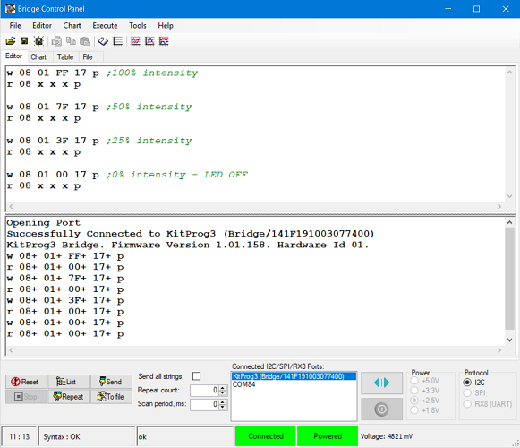
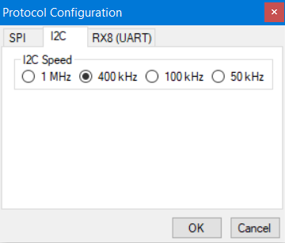

# PSOC&trade; 4: I2C slave using callbacks

This example demonstrates the operation of an I2C resource for PSOC&trade; 4 MCU in the slave mode using callbacks.

[View this README on GitHub.](https://github.com/Infineon/mtb-example-psoc4-i2c-slave-callback)

[Provide feedback on this code example.](https://yourvoice.infineon.com/jfe/form/SV_1NTns53sK2yiljn?Q_EED=eyJVbmlxdWUgRG9jIElkIjoiQ0UyMzA2MDMiLCJTcGVjIE51bWJlciI6IjAwMi0zMDYwMyIsIkRvYyBUaXRsZSI6IlBTT0MmdHJhZGU7IDQ6IEkyQyBzbGF2ZSB1c2luZyBjYWxsYmFja3MiLCJyaWQiOiJzdW1pdC5zaGFudGFudUBpbmZpbmVvbi5jb20iLCJEb2MgdmVyc2lvbiI6IjMuNy4wIiwiRG9jIExhbmd1YWdlIjoiRW5nbGlzaCIsIkRvYyBEaXZpc2lvbiI6Ik1DRCIsIkRvYyBCVSI6IklDVyIsIkRvYyBGYW1pbHkiOiJQU09DIn0=)


## Requirements

- [ModusToolbox&trade;](https://www.infineon.com/modustoolbox) v3.7 or later (tested with v3.7)
- Board support package (BSP) minimum required version: 3.1.0
- Programming language: C
- Associated parts: [PSOC&trade; 4000S, PSOC&trade; 4100S, PSOC&trade; 4100S Plus, PSOC&trade; 4500S, PSOC&trade; 4100S Max, PSOC&trade; 4000T, PSOC&trade; 4100T Plus](https://www.infineon.com/products/microcontroller/32-bit-psoc-arm-cortex/psoc-4-mcu), and [PSOC&trade; 4 HV (High Voltage)](https://www.infineon.com/products/microcontroller/32-bit-psoc-arm-cortex/psoc-4-hv-m0)


## Supported toolchains (make variable 'TOOLCHAIN')

- GNU Arm&reg; Embedded Compiler v14.2.1 (`GCC_ARM`) – Default value of `TOOLCHAIN`
- Arm&reg; Compiler v6.22 (`ARM`)
- IAR C/C++ Compiler v9.50.2 (`IAR`)


## Supported kits (make variable 'TARGET')

- [PSOC&trade; 4100S Max Pioneer Kit](https://www.infineon.com/CY8CKIT-041S-MAX) (`CY8CKIT-041S-MAX`) – Default value of `TARGET`
- [PSOC&trade; 4100S Plus Prototyping Kit](https://www.infineon.com/CY8CKIT-149) (`CY8CKIT-149`)
- [PSOC&trade; 4000S CAPSENSE&trade; Prototyping Kit](https://www.infineon.com/CY8CKIT-145-40XX) (`CY8CKIT-145-40XX`)
- [PSOC&trade; 4100S CAPSENSE&trade; Pioneer Kit](https://www.infineon.com/CY8CKIT-041-41XX) (`CY8CKIT-041-41XX`)
- [PSOC&trade; 4500S Pioneer Kit](https://www.infineon.com/CY8CKIT-045S) (`CY8CKIT-045S`)
- [PSOC&trade; 4000T CAPSENSE&trade; Prototyping Kit](https://www.infineon.com/CY8CPROTO-040T) (`CY8CPROTO-040T`)
- [PSOC&trade; 4000T Multi-Sense Prototyping Kit](https://www.infineon.com/CY8CPROTO-040T-MS) (`CY8CPROTO-040T-MS`)
- [PSOC&trade; 4100T Plus CAPSENSE&trade; Prototyping Kit](https://www.infineon.com/CY8CPROTO-041TP) (`CY8CPROTO-041TP`)
- [PSOC&trade; 4 HVMS-128K Evaluation Kit](https://www.infineon.com/cms/en/product/evaluation-boards/kit_psoc4-hvms-128k_lite/) (`KIT_PSOC4-HVMS-128K_LITE`)
- [PSOC&trade; 4 HVMS-64K Evaluation Kit](https://www.infineon.com/cms/en/product/evaluation-boards/kit_psoc4-hvms-64k_lite/) (`KIT_PSOC4-HVMS-64K_LITE`)
- [PSOC&trade; 4 HVPA-144K Evaluation Kit](https://www.infineon.com/cms/en/product/evaluation-boards/kit_psoc4-hvpa-144k_lite/) (`KIT_PSOC4-HVPA-144K_LITE`)
- [PSOC&trade; 4 HVPA-SPM 1.0 Evaluation Kit](https://www.infineon.com/design-resources/finder-selection-tools/evaluation-board) (`KIT_PSOC-HVPA-SPM1_LITE`)


## Hardware setup

This example uses the board's default configuration for all the kits listed above, except the CY8CPROTO-040T and CY8CPROTO-040T-MS kits. For I2C operation, change the SW2 switch towards I2C on the CY8CPROTO-040T and CY8CPROTO-040T-MS kits. See the kit guide to ensure that the board is configured correctly.

> **Note:** Some of the PSOC&trade; 4 kits ship with KitProg2 installed. ModusToolbox&trade; requires KitProg3. Before using this code example, make sure that the board is upgraded to KitProg3. The tool and instructions are available in the [Firmware Loader](https://github.com/Infineon/Firmware-loader) GitHub repository. If you do not upgrade, you will see an error like "unable to find CMSIS-DAP device" or "KitProg firmware is out of date".

> **Note:** To operate this code example 
   - On the KIT_PSOC4-HVMS-128K_LITE and KIT_PSOC4-HVMS-64K_LITE, move 0 ohm resistors on your kit: from R101, R99, R94, and R96 to R103, R98, R95, and R97.
   - On the KIT_PSOC4-HVPA-144K_LITE, move 0 ohm resistors on your kit: from R101 and R99 to R103 and R98.
   - On the KIT_PSOC-HVPA-SPM1_LITE, move 0 ohm resistors on your kit: from R81 and R79 to R82 and R80.

## Software setup

See the [ModusToolbox&trade; tools package installation guide](https://www.infineon.com/ModusToolboxInstallguide) for information about installing and configuring the tools package.


### Install and configure Bridge Control Panel (BCP)

The BCP software is used for transmitting and receiving data over I2C. It is installed automatically as part of the PSOC&trade; Programmer installation.

1. Download the [PSOC&trade; Programmer](https://softwaretools.infineon.com/tools/com.ifx.tb.tool.psocprogrammer) installer for Windows system

2. Double-click the installer and then follow the instructions to install PSOC&trade; Programmer

3. After installation is complete, open BCP from **Start** > **Bridge Control Panel**

4. Select **KitProg3** under **Connected I2C/SPI/RX8 Ports** and ensure to connect the PSOC&trade; 4 kit to the USB port of your computer

   **Figure 1. Bridge Control Panel**

   

5. Select **Tools** \> **Protocol Configuration**. Navigate to the **I2C** tab, and then set **I2C Speed** to **400 kHz** and click **OK**

   BCP is now ready for transmitting and receiving data

   **Figure 2. Protocol configuration**

   


## Using the code example


### Create the project

The ModusToolbox&trade; tools package provides the Project Creator as both a GUI tool and a command line tool.

<details><summary><b>Use Project Creator GUI</b></summary>

1. Open the Project Creator GUI tool

   There are several ways to do this, including launching it from the dashboard or from inside the Eclipse IDE. For more details, see the [Project Creator user guide](https://www.infineon.com/ModusToolboxProjectCreator) (locally available at *{ModusToolbox&trade; install directory}/tools_{version}/project-creator/docs/project-creator.pdf*)

2. On the **Choose Board Support Package (BSP)** page, select a kit supported by this code example. See [Supported kits](#supported-kits-make-variable-target)

   > **Note:** To use this code example for a kit not listed here, you may need to update the source files. If the kit does not have the required resources, the application may not work

3. On the **Select Application** page:

   a. Select the **Applications(s) Root Path** and the **Target IDE**

      > **Note:** Depending on how you open the Project Creator tool, these fields may be pre-selected for you

   b. Select this code example from the list by enabling its check box

      > **Note:** You can narrow the list of displayed examples by typing in the filter box

   c. (Optional) Change the suggested **New Application Name** and **New BSP Name**

   d. Click **Create** to complete the application creation process

</details>


<details><summary><b>Use Project Creator CLI</b></summary>

The 'project-creator-cli' tool can be used to create applications from a CLI terminal or from within batch files or shell scripts. This tool is available in the *{ModusToolbox&trade; install directory}/tools_{version}/project-creator/* directory.

Use a CLI terminal to invoke the 'project-creator-cli' tool. On Windows, use the command-line 'modus-shell' program provided in the ModusToolbox&trade; installation instead of a standard Windows command-line application. This shell provides access to all ModusToolbox&trade; tools. You can access it by typing "modus-shell" in the search box in the Windows menu. In Linux and macOS, you can use any terminal application.

The following example clones the "I2C slave using callbacks" application with the desired name "MyI2CSlaveCallback" configured for the *CY8CKIT-041S-MAX* BSP into the specified working directory, C:/mtb_projects:

   ```
   project-creator-cli --board-id CY8CKIT-041S-MAX --app-id mtb-example-psoc4-i2c-slave-callback --user-app-name MyI2CSlaveCallback --target-dir "C:/mtb_projects"
   ```

The 'project-creator-cli' tool has the following arguments:

Argument | Description | Required/optional
---------|-------------|-----------
`--board-id` | Defined in the <id> field of the [BSP](https://github.com/Infineon?q=bsp-manifest&type=&language=&sort=) manifest | Required
`--app-id`   | Defined in the <id> field of the [CE](https://github.com/Infineon?q=ce-manifest&type=&language=&sort=) manifest | Required
`--target-dir`| Specify the directory in which the application is to be created if you prefer not to use the default current working directory | Optional
`--user-app-name`| Specify the name of the application if you prefer to have a name other than the example's default name | Optional

<br>

> **Note:** The project-creator-cli tool uses the `git clone` and `make getlibs` commands to fetch the repository and import the required libraries. For details, see the "Project creator tools" section of the [ModusToolbox&trade; tools package user guide](https://www.infineon.com/ModusToolboxUserGuide) (locally available at {ModusToolbox&trade; install directory}/docs_{version}/mtb_user_guide.pdf).

</details>


### Open the project

After the project has been created, you can open it in your preferred development environment.


<details><summary><b>Eclipse IDE</b></summary>

If you opened the Project Creator tool from the included Eclipse IDE, the project will open in Eclipse automatically.

For more details, see the [Eclipse IDE for ModusToolbox&trade; user guide](https://www.infineon.com/MTBEclipseIDEUserGuide) (locally available at *{ModusToolbox&trade; install directory}/docs_{version}/mt_ide_user_guide.pdf*).

</details>


<details><summary><b>Visual Studio (VS) Code</b></summary>

Launch VS Code manually, and then open the generated *{project-name}.code-workspace* file located in the project directory.

For more details, see the [Visual Studio Code for ModusToolbox&trade; user guide](https://www.infineon.com/MTBVSCodeUserGuide) (locally available at *{ModusToolbox&trade; install directory}/docs_{version}/mt_vscode_user_guide.pdf*).

</details>


<details><summary><b>Arm&reg; Keil&reg; µVision&reg;</b></summary>

Double-click the generated *{project-name}.cprj* file to launch the Keil&reg; µVision&reg; IDE.

For more details, see the [Arm&reg; Keil&reg; µVision&reg; for ModusToolbox&trade; user guide](https://www.infineon.com/MTBuVisionUserGuide) (locally available at *{ModusToolbox&trade; install directory}/docs_{version}/mt_uvision_user_guide.pdf*).

</details>


<details><summary><b>IAR Embedded Workbench</b></summary>

Open IAR Embedded Workbench manually, and create a new project. Then select the generated *{project-name}.ipcf* file located in the project directory.

For more details, see the [IAR Embedded Workbench for ModusToolbox&trade; user guide](https://www.infineon.com/MTBIARUserGuide) (locally available at *{ModusToolbox&trade; install directory}/docs_{version}/mt_iar_user_guide.pdf*).

</details>


<details><summary><b>Command line</b></summary>

If you prefer to use the CLI, open the appropriate terminal, and navigate to the project directory. On Windows, use the command-line 'modus-shell' program; on Linux and macOS, you can use any terminal application. From there, you can run various `make` commands.

For more details, see the [ModusToolbox&trade; tools package user guide](https://www.infineon.com/ModusToolboxUserGuide) (locally available at *{ModusToolbox&trade; install directory}/docs_{version}/mtb_user_guide.pdf*).

</details>


## Operation

The I2C resource in slave mode accepts command packets to control the intensity of an LED. The I2C slave updates its read buffer with a status packet in response to the accepted command.

In this example, a host PC running the Bridge Control Panel (BCP) software is used as the I2C master. LED control is implemented using a TCPWM resource (configured as PWM). The intensity of the LED is controlled by changing the duty cycle of the PWM signal.

1. Connect the board to your PC using the provided USB cable through the USB connector

2. Program the board using one of the following:

   <details><summary><b>Using Eclipse IDE</b></summary>

      1. Select the application project in the Project Explorer

      2. In the **Quick Panel**, scroll down, and click **\<Application Name> Program (KitProg3_MiniProg4)**
   </details>


   <details><summary><b>In other IDEs</b></summary>

   Follow the instructions in your preferred IDE.

   </details>


   <details><summary><b>Using CLI</b></summary>

     From the terminal, execute the `make program` command to build and program the application using the default toolchain to the default target. The default toolchain is specified in the application's Makefile but you can override this value manually:
      ```
      make program TOOLCHAIN=<toolchain>
      ```

      Example:
      ```
      make program TOOLCHAIN=GCC_ARM
      ```
   </details>


3. Configure the BCP software as described in [Install and configure Bridge Control Panel (BCP)](#install-and-configure-bridge-control-panel-bcp)

4. In the **Editor** tab of BCP, type the command to send the LED intensity data, and then click **Send**. Observe that the LED turns ON with the specified intensity

   The command format that is used to write the data to the slave if BCP is used as the I2C master is shown as follows. The symbol ‘SoP’ means ‘start of packet’ and ‘EoP’ means ‘end of packet’


   Start for write | Slave address | SoP  | LED TCPWM compare value | EoP  | Stop
   ---------------|---------------|------|-------------------------|------|-----
    w              | 0x08          | 0x01 | 0x00 to 0xFF            | 0x17 | p

   <br>

   For example, sending the command `w 08 01 FF 17 p` will turn the LED ON with full intensity; sending the command `w 08 01 00 17 p` will turn the LED OFF

5. Type the command `r 08 x x x p` to read the status of the write performed

   The following is the command format to read the status form the slave’s read buffer. The symbol ‘x’ denotes one byte to read from the slave’s read buffer. In this example, three bytes are read from the slave

   Start for read | Slave address | SoP | LED TCPWM compare value | EoP | Stop
    ----------------|---------------|-----|-------------------------|-----|------
    r              | 0x08          | x   | x                       | x   | p

   <br>

   After each command is sent, the status packet must be read from the read buffer of the slave by sending the `r 08 x x x p` command. If the packet read is in the format `r 08 01 00 17 p`, the status is set as 'success'; if the packet read is `r 08 01 FF 17 p`, the status is set as 'fail' for the command sent by the I2C master. See Figure 1 for more information


## Debugging

You can debug the example to step through the code.


<details><summary><b>In Eclipse IDE</b></summary>

Use the **\<Application Name> Debug (KitProg3_MiniProg4)** configuration in the **Quick Panel**. For details, see the "Program and debug" section in the [Eclipse IDE for ModusToolbox&trade; user guide](https://www.infineon.com/MTBEclipseIDEUserGuide).

</details>


<details><summary><b>In other IDEs</b></summary>

Follow the instructions in your preferred IDE.

</details>


## Design and implementation

This example demonstrates the operation of an I2C resource for PSOC&trade; 4 in the slave mode using callbacks. The I2C slave is configured with a 3-byte write buffer, which can be accessed by the I2C master to write commands. In addition, a 3-byte read buffer is configured to read the status of the slave by the master. The BCP software is used as the I2C master.

The first byte in the write buffer contains the start of packet (SoP) value, the next byte contains the LED’s TCPWM compare value, and the third byte is the end of packet (EoP) value. The slave updates the master’s read buffer with the status packet. The first byte of the status packet is SoP, the second byte contains the status where the value 0x00 means success and 0xFF means failure for the command data sent by the master, and the third byte in the read buffer is EoP.

To control the intensity of the LED, a PWM with a period value of 255 microseconds is used. The duty cycle of the PWM is controlled in firmware and is specified by the I2C master.

In the callback method, data write and read complete events from the master are handled through interrupts. I2C Peripheral Driver Library (PDL) APIs are used to configure the resource to act as an I2C slave, and to configure its relevant interrupts to handle data write and read complete events by the master.


### Resources and settings

**Table 1. Application resources**

 Resource          |  Alias/object     |    Purpose
 :---------------- | :---------------- | :--------------------
 I2C               | CYBSP_I2C         | I2C slave
 TCPWM (PWM)       | CYBSP_PWM         | PWM to drive the user LED

<br>


## Related resources

Resources  | Links
-----------|----------------------------------
Application notes  | [AN79953](https://www.infineon.com/AN79953) – Getting started with PSOC&trade; 4 MCU <br>[AN0034](https://www.infineon.com/row/public/documents/10/42/infineon-an0034-getting-started-with-psoc-4-hv-ms-mcus-in-modustoolbox-applicationnotes-en.pdf) - Getting started with PSOC&trade; 4 HV MS and PSOC&trade; 4 HV PA MCUs in ModusToolbox&trade;
Code examples  | [Using ModusToolbox&trade;](https://github.com/Infineon/Code-Examples-for-ModusToolbox-Software) on GitHub
Device documentation |[PSOC&trade; 4 datasheets](https://documentation.infineon.com/psoc4/docs/qqs1702048028479) <br>[PSOC&trade; 4 technical reference manuals](https://documentation.infineon.com/psoc4/docs/hup1702048028817) <br>[PSOC&trade; 4 HV MS 64k datasheets](https://documentation.infineon.com/psoc4atv/docs/lov1747976741007) <br>[PSOC&trade; 4 HV MS 64k reference manuals](https://documentation.infineon.com/psoc4atv/docs/sfz1747976866500) <br>[PSOC&trade; 4 HV MS 128k datasheets](https://documentation.infineon.com/psoc4atv/docs/ypt1703926222536) <br>[PSOC&trade; 4 HV MS 128k reference manuals](https://documentation.infineon.com/psoc4atv/docs/fsx1703926693671) <br>[PSOC&trade; 4 HV PA datasheets](https://documentation.infineon.com/psoc4atv/docs/rsd1669346756301) <br>[PSOC&trade; 4 HV PA reference manuals](https://documentation.infineon.com/psoc4atv/docs/vkg1670389100008)
Development kits | Select your kits from the [Evaluation board finder](https://www.infineon.com/cms/en/design-support/finder-selection-tools/product-finder/evaluation-board)
Libraries on GitHub | [mtb-pdl-cat2](https://github.com/Infineon/mtb-pdl-cat2) – PSOC&trade; 4 Peripheral Driver Library (PDL)<br> [mtb-hal-cat2](https://github.com/Infineon/mtb-hal-cat2) – Hardware Abstraction Layer (HAL) library
Tools  | [ModusToolbox&trade;](https://www.infineon.com/modustoolbox) – ModusToolbox&trade; software is a collection of easy-to-use libraries and tools enabling rapid development with Infineon MCUs for applications ranging from wireless and cloud-connected systems, edge AI/ML, embedded sense and control, to wired USB connectivity using PSOC&trade; Industrial/IoT MCUs, AIROC&trade; Wi-Fi and Bluetooth&reg; connectivity devices, XMC&trade; Industrial MCUs, and EZ-USB&trade;/EZ-PD&trade; wired connectivity controllers. ModusToolbox&trade; incorporates a comprehensive set of BSPs, HAL, libraries, configuration tools, and provides support for industry-standard IDEs to fast-track your embedded application development

<br>


## Other resources

Infineon provides a wealth of data at [www.infineon.com](https://www.infineon.com) to help you select the right device, and quickly and effectively integrate it into your design.


## Document history

Document title: *CE230603* – *PSOC&trade; 4: I2C slave using callbacks*

 Version | Description of change
 ------- | ---------------------
 1.0.0   | New code example
 2.0.0   | Major update to support ModusToolbox&trade; software v2.2, added support for new kits<br> This version is not backward compatible with ModusToolbox&trade; software v2.1
 2.1.0   | Added support for new kits
 3.0.0   | Major update to support ModusToolbox&trade; v3.0. This version is not backward compatible with previous versions of ModusToolbox&trade;
 3.1.0   | Added support for CY8CPROTO-040T and updated to support ModusToolbox&trade; v3.1
 3.2.0   | Added support for KIT_PSOC4-HVMS-128K_LITE and KIT_PSOC4-HVMS-64K_LITE, and updated to support ModusToolbox&trade; v3.2
 3.3.0   | Added support for CY8CPROTO-040T-MS and updated to support ModusToolbox&trade; v3.4
 3.4.0   | Added support for CY8CPROTO-041TP and updated to support ModusToolbox&trade; v3.5. <br> Changed HVMS kit name PSoC&trade; 4 to PSOC&trade; 4
 3.5.0   | Added support for KIT_PSOC4-HVMS-128K_LITE-02 and KIT_PSOC4-HVMS-64K_LITE-02
 3.6.0   | Added support for KIT_PSOC4-HVPA-144K_LITE
 3.7.0   | Added support for KIT_PSOC-HVPA-SPM1_LITE and updated to support ModusToolbox&trade; v3.7
<br>


All referenced product or service names and trademarks are the property of their respective owners.

The Bluetooth&reg; word mark and logos are registered trademarks owned by Bluetooth SIG, Inc., and any use of such marks by Infineon is under license.

PSOC&trade;, formerly known as PSoC&trade;, is a trademark of Infineon Technologies. Any references to PSoC&trade; in this document or others shall be deemed to refer to PSOC&trade;.

---------------------------------------------------------

(c) 2020-2026, Infineon Technologies AG, or an affiliate of Infineon Technologies AG. All rights reserved.
This software, associated documentation and materials ("Software") is owned by Infineon Technologies AG or one of its affiliates ("Infineon") and is protected by and subject to worldwide patent protection, worldwide copyright laws, and international treaty provisions. Therefore, you may use this Software only as provided in the license agreement accompanying the software package from which you obtained this Software. If no license agreement applies, then any use, reproduction, modification, translation, or compilation of this Software is prohibited without the express written permission of Infineon.
<br>
Disclaimer: UNLESS OTHERWISE EXPRESSLY AGREED WITH INFINEON, THIS SOFTWARE IS PROVIDED AS-IS, WITH NO WARRANTY OF ANY KIND, EXPRESS OR IMPLIED, INCLUDING, BUT NOT LIMITED TO, ALL WARRANTIES OF NON-INFRINGEMENT OF THIRD-PARTY RIGHTS AND IMPLIED WARRANTIES SUCH AS WARRANTIES OF FITNESS FOR A SPECIFIC USE/PURPOSE OR MERCHANTABILITY. Infineon reserves the right to make changes to the Software without notice. You are responsible for properly designing, programming, and testing the functionality and safety of your intended application of the Software, as well as complying with any legal requirements related to its use. Infineon does not guarantee that the Software will be free from intrusion, data theft or loss, or other breaches (“Security Breaches”), and Infineon shall have no liability arising out of any Security Breaches. Unless otherwise explicitly approved by Infineon, the Software may not be used in any application where a failure of the Product or any consequences of the use thereof can reasonably be expected to result in personal injury.
